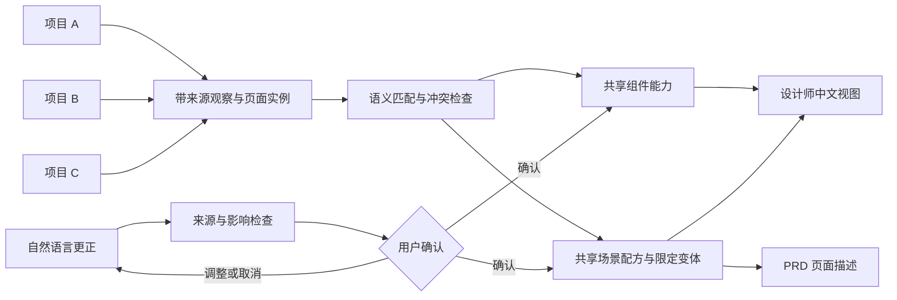

<div align="center">

# oh-my-ui

**让多个前端项目持续补充同一份、面向设计师的中文 UI 设计知识库。**

[English](README_EN.md) · 中文


</div>

## 项目简介

`oh-my-ui` 是一个同时面向 Claude Code 与 Codex 的插件。它把 A、B、C 等前端项目中的页面入口、布局关系、真实组件用法、任务状态、角色权限和用户流程，持续归并到同一份可查询、可追溯、可受控更正的 UI 设计知识库。

它不会给设计师输出工程组件清单，也不会使用类似 `er-input`、属性名、源码路径或框架术语描述页面。最终内容回答的是：

- 用户在什么业务场景下完成什么任务？
- 页面整体长什么样，主次区域如何排列？
- 页面从应用外壳、布局骨架、区域到具体设计组件如何逐层组成？
- 每种设计组件适用于什么场景，与哪些组件怎样搭配？
- 初始、加载、空、失败、权限受限和部分成功时如何变化？
- 什么情况下适用，什么情况下应选择另一种页面形态？
- 哪些是现状观察，哪些只是候选规律，哪些已成为正式规范？

> [!IMPORTANT]
> 历史代码只能证明某种实现在某个来源项目中存在过，不能自动证明它是正确的设计规范。多个项目重复采用也只会提高证据广度，不会自动升级为正式规范。

## 核心能力

| 能力 | 说明 | 是否修改知识库 |
|---|---|---|
| 扫描建库 | 让多个来源项目向统一知识库贡献组件观察、共享场景和带来源页面实例 | 是 |
| PRD 查询 | 先匹配任务场景，再按场景配方选择组件，生成从页面全景到组件实例的 UI 描述 | 否，只读 |
| 受控更正 | 将自然语言反馈转换为结构化提案，检查关联场景和规则冲突，确认后提交新版本 | 确认后修改 |

三个入口分别位于：

- [`build-ui-knowledge`](skills/build-ui-knowledge/SKILL.md)
- [`query-ui-knowledge`](skills/query-ui-knowledge/SKILL.md)
- [`correct-ui-knowledge`](skills/correct-ui-knowledge/SKILL.md)

## 工作原理



路由是扫描入口，但不是页面全貌。同一路由在不同布局、业务状态、角色权限或进入方式下可能对应不同页面结构；没有独立路由的弹层、侧向辅助区和阶段状态也会从真实触发点继续追踪。组件定义也不是组件规范：只有结合真实调用、周围文案、位置、组合、状态和样式关系，才能归纳为中文设计组件能力。

核心模型是：

```text
来源项目中的真实调用与页面实例 → 组件能力与场景语义归并 → 场景页面骨架 → PRD UI 描述
```

## 知识库分层

生成结果分成设计师可见层和 Agent 内部层：

```text
统一知识库根目录/
└── doc/ui/
    ├── UI设计知识库/             # 设计师、产品和业务人员阅读
    │   ├── 00-知识库导航.md
    │   ├── 01-通用设计规则.md
    │   ├── 场景/                 # 跨项目复用的主知识
    │   │   └── <扫描后归纳的场景分组>.md
    │   ├── 组件/                 # 中文设计组件的适用、禁用与组合规范
    │   ├── 02-页面形态索引.md
    │   ├── 03-来源项目索引.md
    │   ├── 04-组件使用规范索引.md
    │   ├── 05-项目案例索引.md
    │   └── 99-待确认事项.md
    └── .ui-knowledge/            # Agent 使用的隐藏事实源
        ├── knowledge.json
        ├── evidence.jsonl
        └── changes.jsonl
```

可复用主知识只有两层：组件说明“什么时候用”，场景说明“为什么这样搭配、页面形态和布局骨架如何组织”。真实页面以 `pageInstances` 留在隐藏事实源，只为场景提供带来源的组合实例、变体和反例，不再生成平级 `页面/` 正文。

`init` 不会内置来源项目、场景或组件。每次扫描先登记来源项目，再把页面实例和证据与已有场景做语义归并；演示目录中的六类场景只是合成示例，不是扫描模板。

扫描使用两个根目录：`sourceRoot` 是本次读取的业务项目，`knowledgeRoot` 是持续累计的统一知识库。所有脚本参数都传 `knowledgeRoot`；schema 1.1.0 可用 `migrate-kb.mjs` 安全迁移到 2.0.0。

## 快速开始

### 环境要求

- Node.js 18 或更高版本。
- Claude Code，或支持插件的 Codex / ChatGPT 桌面端环境。
- 一个可读取的真实前端项目。没有业务源码时只能查看演示，不能声称完成了正式扫描。

内置脚本只使用 Node.js 标准库，不需要执行 `npm install`。

### Claude Code：从 marketplace 安装

仓库根目录同时也是一个 Claude marketplace，不需要再增加 `plugins/oh-my-ui` 包装层。本地安装：

```bash
claude plugin marketplace add /absolute/path/to/oh-my-ui
claude plugin install oh-my-ui@oh-my-ui
```

如果仓库已经发布到 GitHub，可以直接添加 GitHub 仓库：

```bash
claude plugin marketplace add <owner>/oh-my-ui
claude plugin install oh-my-ui@oh-my-ui
```

安装完成后，在 Claude Code 中运行 `/help`，可以看到以下命名空间 Skill：

```text
/oh-my-ui:build-ui-knowledge
/oh-my-ui:query-ui-knowledge
/oh-my-ui:correct-ui-knowledge
```

### Claude Code：开发模式直接加载

在需要扫描的前端项目目录中启动 Claude Code，并通过绝对路径加载本插件：

```bash
cd /path/to/frontend-project
claude --plugin-dir /absolute/path/to/oh-my-ui
```

插件加载后同样可以使用：

```text
/oh-my-ui:build-ui-knowledge
/oh-my-ui:query-ui-knowledge
/oh-my-ui:correct-ui-knowledge
```

Claude Code 会使用插件名作为 Skill 命名空间。开发过程中修改插件后，可在 Claude Code 中运行 `/reload-plugins`。marketplace 安装和 `--plugin-dir` 开发加载的区别以 [Claude Code marketplace 文档](https://code.claude.com/docs/en/plugin-marketplaces) 为准。

### Codex / ChatGPT 桌面端

Codex 插件需要通过本地 marketplace 注册后，才能出现在 Plugins Directory。本仓库不会自动修改你的个人插件配置。

在 Codex 中可以让内置插件创建工具将现有目录接入个人 marketplace：

```text
使用 $plugin-creator，把 /absolute/path/to/oh-my-ui 作为名为 oh-my-ui 的现有插件接入我的个人 marketplace。
```

完成后重启桌面端，从本地来源安装 `oh-my-ui`。安装后可显式调用：

```text
使用 $build-ui-knowledge 扫描当前前端项目，并把结果归并到 /path/to/shared-ui-knowledge。
使用 $query-ui-knowledge 根据这份 PRD 推断页面结构和场景组合。
使用 $correct-ui-knowledge 检查这条更正与现有场景是否冲突。
```

Codex marketplace 的正式目录结构和安装边界以 [OpenAI 插件文档](https://developers.openai.com/plugins/build/plugins) 为准。

## 推荐工作流

### 1. 初始化统一知识库

```bash
mkdir -p /path/to/shared-ui-knowledge
node scripts/init-kb.mjs /path/to/shared-ui-knowledge --name "团队 UI 设计知识库"
```

旧版项目级知识库先迁移：

```bash
node scripts/migrate-kb.mjs /path/to/old-knowledge --source-root /path/to/project-a
```

### 2. 先做黄金样本

选择一个同时包含列表、详情、编辑和状态变化的代表性业务模块，先验证：

- 场景命名是否符合团队语言。
- 页面结构还原是否准确。
- 组件是否覆盖真实调用场景、位置、搭配和状态，而不是只扫描定义。
- 场景中的页面形态和布局骨架是否足以让设计师理解主次区域。
- 页面实例是否完整保留来源、应用外壳、区域、组件、状态和覆盖信息，而没有成为平级规范。
- 是否遗漏角色、权限和异常状态。
- 是否成功过滤工程术语。
- 现状观察与正式规范是否被正确区分。

确认样本后，再扩展到整个项目和其他来源项目。

### 3. 让 A、B 项目持续补充

扫描单位不是单个文件，而是：

```text
路由 × 布局链 × 任务状态 × 角色/权限 × 进入方式
```

Agent 会为每个来源项目分别建立画像、路由账本和组件账本，再逐项追踪页面结构。真实页面保存为内部实例，然后按用户目标、对象范围、任务阶段、时长、风险、结果和组件角色与全库场景匹配。

```text
扫描 /project-a，把证据归并到 /shared-ui-knowledge。
扫描 /project-b，继续补充 /shared-ui-knowledge，不要新建第二份知识库。
```

语义相同的场景追加来源与证据；主任务相同但条件差异稳定时形成变体；同条件冲突进入待确认；实质不同才创建新场景。

### 4. 使用 PRD 查询

查询会先提取用户目标、对象范围、任务阶段、处理时长、风险、结果方式、权限和异常状态，然后选择主场景与辅场景，合并组件配方，并按需读取来自不同项目的 1–3 个页面实例，最后输出统一的八段页面描述。

示例：

```text
运营人员需要筛选一批待处理对象，批量提交任务，几分钟后回来查看失败对象并重试。这个需求应该长什么样？
```

预期会组合“查找与结果浏览”“批量与异步处理”“异常与结果反馈”，再根据这些场景选择范围确认、任务行动和状态恢复等设计组件；输出的是完整页面结构，不是工程组件名或零散组件清单。

### 5. 用自然语言更正

```text
这个审核任务不是在当前页面完成。因为内容很多、风险较高，应该进入独立任务空间。
```

插件不会立即覆盖知识，而是先展示：

- 更正类型和目标知识。
- 原内容与建议内容。
- 影响的来源项目、场景、变体、实例和索引。
- 与通用规则、页面形态及例外的冲突。
- 预计版本变化。

只有语义更正得到明确确认后，才会提交新 revision 并追加变更历史。

## 256k 上下文控制

`oh-my-ui` 不依赖一次性加载整个项目。默认采用渐进式工作集：

1. 全库轻量索引。
2. 当前来源项目画像。
3. 单个路由摘要与直接依赖。
4. 相关场景候选。
5. 按需页面实例与证据。

单次只处理一个来源项目中的一个路由任务链，完成后写入该项目的磁盘检查点。工作上下文以约 160k 为软上限，并预留至少 30% 用于跨项目归并、冲突检查和最终生成。

## 知识治理

| 状态 | 含义 |
|---|---|
| `observed` | 从源码、运行页面、测试或人工说明中观察到的事实 |
| `candidate` | 从多条观察归纳出的候选规律，尚未正式确认 |
| `normative` | 团队明确确认，可用于约束后续设计 |
| `exception` | 只在限定条件下覆盖一般规则 |
| `hypothesis` | 尚待验证的想法，不参与强制推断 |

可信度使用 `low`、`medium`、`high`。知识状态和可信度是两个独立维度：强证据或多项目重复都不自动成为规范，正式规范也可能因为覆盖不足而需要继续验证。

## 确定性工具

脚本不负责理解页面语义，只承担可复核的机械工作：

| 命令 | 作用 |
|---|---|
| `node scripts/init-kb.mjs <knowledgeRoot>` | 安全初始化空的多项目知识库，默认拒绝覆盖 |
| `node scripts/derive-source-key.mjs <sourceRoot> [--id <项目ID>]` | 用非路径信号生成稳定来源身份；只有路径时拒绝猜测 |
| `node scripts/migrate-kb.mjs <knowledgeRoot> --source-root <旧项目>` | 将 schema 1.1.0 页面蓝图迁移为 2.0.0 内部页面实例并保留备份 |
| `node scripts/render-kb.mjs <knowledgeRoot>` | 从隐藏事实源重新生成设计师视图 |
| `node scripts/validate-kb.mjs <knowledgeRoot>` | 校验来源、语义键、实例引用、覆盖分母和工程术语泄漏 |
| `node scripts/commit-kb.mjs <knowledgeRoot> <候选知识> <变更记录> [候选证据]` | 原子提交知识、证据、设计师视图和变更记录，并阻止无声明删除 |
| `node scripts/self-test.mjs` | 测试多项目初始化、迁移、渲染、提交和版本冲突拒绝 |

## 本地验证

```bash
node scripts/self-test.mjs
node scripts/validate-kb.mjs ui-knowledge-demo
claude plugin validate .
```

仓库中的 [`ui-knowledge-demo`](ui-knowledge-demo/doc/ui/UI设计知识库/00-知识库导航.md) 是合成结构示例，不代表任何真实产品的正式规范。

## 仓库结构

```text
oh-my-ui/
├── .codex-plugin/          # Codex 插件清单
├── .claude-plugin/         # Claude Code 插件与 marketplace 清单
├── skills/                 # 扫描、查询和更正工作流
├── references/             # 知识契约与质量规则
├── assets/templates/       # 初始结构模板
├── scripts/                # 确定性 Node.js 工具
└── ui-knowledge-demo/      # 合成示例知识库
```

## 安全与边界

- 不索取、保存或绕过登录凭证、验证码、权限和风控。
- 不因扫描结果自动修改业务源码。
- 不把看不到的状态推断为不存在。
- 不把历史高频实现自动提升为正式规范。
- 不默认整理颜色、像素、字号和品牌视觉系统。
- 运行页面只能提高可信度，不能替代源码中的权限和状态分支。

## 参与贡献

欢迎通过 Issue 或 Pull Request 提交：

- 新的真实项目抽象模式和边界案例。
- 场景分类、冲突检查或设计师语言质量改进。
- 不泄露业务源码的合成测试样例。
- 对 Claude Code 与 Codex 插件兼容性的修复。

提交前请至少运行：

```bash
node scripts/self-test.mjs
node scripts/validate-kb.mjs ui-knowledge-demo
```

## 许可证

本项目采用 [MIT License](LICENSE)。

## 相关文档

- [OpenAI：Package your plugin](https://developers.openai.com/plugins/build/plugins)
- [OpenAI：Build skills](https://developers.openai.com/plugins/build/skills)
- [Claude Code：Create plugins](https://code.claude.com/docs/en/plugins)
- [Claude Code：Plugin marketplaces](https://code.claude.com/docs/en/plugin-marketplaces)
