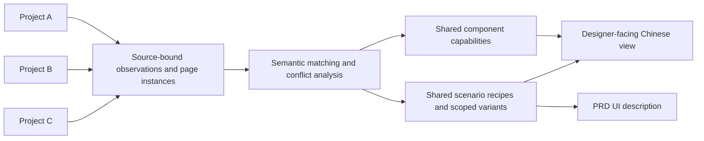

<div align="center">

# oh-my-ui

**Let multiple frontend projects continuously enrich one designer-facing UI knowledge base.**

English · [中文](README.md)


</div>

## Overview

`oh-my-ui` is a plugin for both Claude Code and Codex. It studies project A, then B, then C—their page entries, layout chains, real component usage, task states, permissions, and user flows—and incrementally merges their evidence into one queryable, traceable, and safely correctable UI design knowledge base.

The designer-facing output does not expose engineering component names, props, source paths, framework terminology, or code. Instead, it answers questions such as:

- What user task is being completed in this business scenario?
- What does the page look like, and how are primary and supporting regions arranged?
- How does the page decompose from application shell and layout skeleton to regions and design-component instances?
- When should each design component be used, avoided, or combined with another component?
- How does the page change during loading, empty, failure, restricted, and partial-success states?
- When should this page shape be used, and when should another one be selected?
- Which conclusions are observations, candidate patterns, confirmed rules, or unresolved questions?

> [!IMPORTANT]
> Historical code proves that an implementation existed in a particular source project. Even repetition across projects increases only evidence breadth; it does not automatically create a design standard.

## Core capabilities

| Capability | What it does | Writes to the knowledge base |
|---|---|---|
| Build | Lets multiple source projects contribute component observations, shared scenarios, and source-bound page instances | Yes |
| Query | Matches task scenarios, selects components through scenario recipes, and outputs a top-down UI blueprint | No, read-only |
| Correct | Converts natural-language feedback into a structured proposal, checks related knowledge for conflicts, and commits only after confirmation | After confirmation |

The three workflow skills are:

- [`build-ui-knowledge`](skills/build-ui-knowledge/SKILL.md)
- [`query-ui-knowledge`](skills/query-ui-knowledge/SKILL.md)
- [`correct-ui-knowledge`](skills/correct-ui-knowledge/SKILL.md)

## How it works



A route is the starting point, not the complete page model. The same route may render different task structures under different layouts, business states, roles, permissions, or entry paths. Dialogs, side panels, and task stages without their own route are traced from their real trigger points.

## Knowledge-base layers

Generated knowledge is split into a human-facing layer and an internal Agent layer:

```text
shared-knowledge-root/
└── doc/ui/
    ├── UI设计知识库/             # Read by designers, product, and business teams
    │   ├── 00-知识库导航.md
    │   ├── 01-通用设计规则.md
    │   ├── 场景/                  # Reusable cross-project scenario knowledge
    │   │   └── <discovered-scenario-group>.md
    │   ├── 组件/                  # Designer-facing component usage rules
    │   ├── 02-页面形态索引.md
    │   ├── 03-来源项目索引.md
    │   ├── 04-组件使用规范索引.md
    │   ├── 05-项目案例索引.md
    │   └── 99-待确认事项.md
    └── .ui-knowledge/             # Internal source of truth for the Agent
        ├── knowledge.json
        ├── evidence.jsonl
        └── changes.jsonl
```

Reusable knowledge has two layers: components explain when to use a capability, while scenarios explain why capabilities are combined and include the recommended page form and layout skeleton. Real pages remain in the hidden source of truth as `pageInstances`; they provide source-bound examples, variants, and counter-evidence without creating a parallel page-rule layer.

Initialization creates an empty multi-project schema. It does not seed source projects, scenarios, components, or page instances. The six groups in the demo are synthetic examples, not a built-in taxonomy.

Scanning uses two roots: `sourceRoot` is the project currently being read, and `knowledgeRoot` is the shared, cumulative knowledge base. All deterministic scripts receive `knowledgeRoot`. Schema 1.1.0 knowledge bases can be migrated safely to 2.0.0.

## Quick start

### Requirements

- Node.js 18 or newer.
- Claude Code, or a Codex / ChatGPT desktop environment with plugin support.
- A readable, representative frontend project. Without real business source code, the plugin can demonstrate structure but cannot claim a completed production scan.

The bundled scripts use only Node.js standard-library modules; no `npm install` is required.

### Claude Code: install from the marketplace

The repository root is also a Claude marketplace. No additional `plugins/oh-my-ui` wrapper directory is required. To install from a local checkout:

```bash
claude plugin marketplace add /absolute/path/to/oh-my-ui
claude plugin install oh-my-ui@oh-my-ui
```

After publishing the repository to GitHub, users can add it directly:

```bash
claude plugin marketplace add <owner>/oh-my-ui
claude plugin install oh-my-ui@oh-my-ui
```

After installation, run `/help` in Claude Code to find the namespaced skills:

```text
/oh-my-ui:build-ui-knowledge
/oh-my-ui:query-ui-knowledge
/oh-my-ui:correct-ui-knowledge
```

### Claude Code: direct development loading

Start Claude Code from the frontend project you want to analyze and load this plugin by absolute path:

```bash
cd /path/to/frontend-project
claude --plugin-dir /absolute/path/to/oh-my-ui
```

The same plugin skills are available:

```text
/oh-my-ui:build-ui-knowledge
/oh-my-ui:query-ui-knowledge
/oh-my-ui:correct-ui-knowledge
```

Claude Code namespaces plugin skills with the plugin name. During development, run `/reload-plugins` after changing the plugin files. See the [Claude Code marketplace documentation](https://code.claude.com/docs/en/plugin-marketplaces) for the distinction between marketplace installation and `--plugin-dir` development loading.

### Codex / ChatGPT desktop

Codex plugins must be registered through a local marketplace before they appear in the Plugins Directory. This repository intentionally does not modify your personal plugin configuration.

You can ask the built-in plugin creator in Codex to connect this existing directory to your personal marketplace:

```text
Use $plugin-creator to add /absolute/path/to/oh-my-ui to my personal marketplace as an existing plugin named oh-my-ui.
```

Restart the desktop app and install `oh-my-ui` from the local source. You can then invoke its workflows explicitly:

```text
Use $build-ui-knowledge to scan this frontend project and merge it into /path/to/shared-ui-knowledge.
Use $query-ui-knowledge to infer the page structure and scenario composition for this PRD.
Use $correct-ui-knowledge to check whether this correction conflicts with existing scenarios.
```

See the [OpenAI plugin documentation](https://developers.openai.com/plugins/build/plugins) for the authoritative Codex marketplace layout and installation boundaries.

## Recommended workflow

### 1. Initialize the shared knowledge base

```bash
mkdir -p /path/to/shared-ui-knowledge
node scripts/init-kb.mjs /path/to/shared-ui-knowledge --name "Team UI knowledge base"
```

Migrate a legacy project-scoped knowledge base before adding more sources:

```bash
node scripts/migrate-kb.mjs /path/to/old-knowledge --source-root /path/to/project-a
```

### 2. Start with a golden sample

Choose one representative business module containing a collection view, object details, editing, and meaningful state changes. Validate:

- Whether scenario names match the team's business language.
- Whether scenario page forms and layout skeletons are reconstructed accurately.
- Whether detailed real-page structures remain source-bound internal instances rather than parallel rules.
- Whether role, permission, and exception states are covered.
- Whether engineering terminology is filtered from designer output.
- Whether implementation observations remain separate from confirmed standards.

Expand to the full project and additional source projects only after the sample is accepted.

### 3. Let projects A and B contribute incrementally

The unit of analysis is not a source file. It is:

```text
Route × Layout chain × Task state × Role/permission × Entry path
```

The Agent maintains a separate profile and scan ledger for every source project. It follows direct dependencies, state branches, overlays, and downstream task entries one scan unit at a time, saving each complete real page as an internal source-bound instance.

It then matches component observations and scenario semantics against the shared library. Equivalent semantics append evidence; stable conditional differences become variants; same-condition conflicts remain unresolved; materially different tasks create new scenarios.

### 4. Query with a PRD

The query workflow extracts user goal, object scope, task stage, duration, risk, result mode, permissions, and exception states. It selects a primary scenario, adds supporting scenarios, resolves component recipes, and optionally reads one to three page instances from different source projects before generating a new UI description.

Example:

```text
An operator needs to filter a set of pending objects, submit a batch job, return a few minutes later, inspect failed objects, and retry them. What should this experience look like?
```

The expected answer combines search and result browsing, batch and asynchronous processing, and failure recovery. It does not return an implementation component name.

### 5. Correct knowledge naturally and safely

```text
This review task should not happen inside the current page. It contains too much context and is high risk, so it should use a dedicated task space.
```

The plugin does not overwrite knowledge immediately. It first previews:

- Correction type and target knowledge.
- Current and proposed content.
- Source projects, scenarios, variants, page instances, and indexes that may be affected.
- Conflicts with general rules, scenario page forms, variants, and exceptions.
- Expected revision change.

Semantic changes are committed only after explicit confirmation, with a new revision and an append-only change record.

## Working within a 256k context window

`oh-my-ui` does not depend on loading an entire repository at once. It uses progressive working sets:

1. Lightweight shared-library index.
2. Current source-project profile.
3. One route summary and direct dependencies.
4. Related scenario candidates.
5. Page instances and evidence on demand.

Only one route task chain from one source project stays active at a time, and conclusions are checkpointed before moving on. The workflow uses roughly 160k tokens as a soft working limit and reserves at least 30% for cross-project merging, conflict analysis, and final generation.

## Knowledge governance

| Status | Meaning |
|---|---|
| `observed` | A fact observed in source, runtime UI, tests, or human input |
| `candidate` | A pattern inferred from observations but not formally approved |
| `normative` | An explicitly confirmed rule for future design work |
| `exception` | A scoped override that applies only under stated conditions |
| `hypothesis` | An idea awaiting validation and excluded from strong inference |

Confidence uses `low`, `medium`, and `high`. Status and confidence are independent: strong evidence or repetition across projects does not automatically create a standard, while a confirmed rule may still require broader validation.

## Deterministic tools

Scripts perform auditable mechanical work. They do not infer page semantics:

| Command | Purpose |
|---|---|
| `node scripts/init-kb.mjs <knowledgeRoot>` | Safely initialize an empty multi-project knowledge base |
| `node scripts/derive-source-key.mjs <sourceRoot> [--id <project-id>]` | Derive a stable non-path source identity and refuse path-only guesses |
| `node scripts/migrate-kb.mjs <knowledgeRoot> --source-root <legacy-source>` | Migrate schema 1.1.0 page blueprints into schema 2.0.0 internal page instances with a backup |
| `node scripts/render-kb.mjs <knowledgeRoot>` | Regenerate designer views from the hidden source of truth |
| `node scripts/validate-kb.mjs <knowledgeRoot>` | Validate source provenance, semantic keys, instance references, coverage totals, and language boundaries |
| `node scripts/commit-kb.mjs <knowledgeRoot> <candidate> <change-record> [candidate-evidence]` | Atomically commit knowledge, evidence, designer views, and history while rejecting undeclared removals |
| `node scripts/self-test.mjs` | Test multi-project initialization, migration, rendering, commit, and stale-revision rejection |

## Local validation

```bash
node scripts/self-test.mjs
node scripts/validate-kb.mjs ui-knowledge-demo
claude plugin validate .
```

The bundled [`ui-knowledge-demo`](ui-knowledge-demo/doc/ui/UI设计知识库/00-知识库导航.md) is synthetic. It demonstrates the information architecture and does not represent a production design standard.

## Repository structure

```text
oh-my-ui/
├── .codex-plugin/          # Codex manifest
├── .claude-plugin/         # Claude Code plugin and marketplace manifests
├── skills/                 # Build, query, and correction workflows
├── references/             # Knowledge contract and quality policy
├── assets/templates/       # Initial data template
├── scripts/                # Deterministic Node.js utilities
└── ui-knowledge-demo/      # Synthetic example knowledge base
```

## Safety and scope

- Never request, retain, or bypass credentials, verification challenges, permissions, or risk controls.
- Never edit business source code as a side effect of scanning.
- Never turn an unobserved state into a claim that the state does not exist.
- Never promote frequent historical implementation to a formal rule automatically.
- Colors, pixel values, typography, and brand systems are out of scope by default.
- Runtime inspection can raise confidence, but it cannot replace permission and state branches found in source.

## Contributing

Issues and pull requests are welcome, especially for:

- New frontend abstraction patterns and difficult edge cases.
- Better scenario taxonomy, conflict checks, or designer-facing language.
- Synthetic test fixtures that do not expose proprietary business source.
- Claude Code and Codex plugin compatibility fixes.

Before submitting a pull request, run at least:

```bash
node scripts/self-test.mjs
node scripts/validate-kb.mjs ui-knowledge-demo
```

## License

This project is licensed under the [MIT License](LICENSE).

## Documentation

- [OpenAI: Package your plugin](https://developers.openai.com/plugins/build/plugins)
- [OpenAI: Build skills](https://developers.openai.com/plugins/build/skills)
- [Claude Code: Create plugins](https://code.claude.com/docs/en/plugins)
- [Claude Code: Plugin marketplaces](https://code.claude.com/docs/en/plugin-marketplaces)
